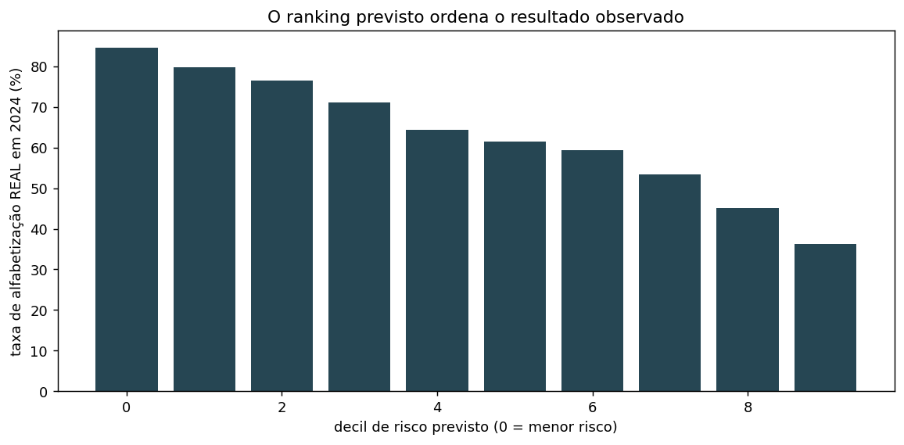

# Predição e Inteligência Analítica para Alfabetização no Brasil

Tech Challenge — Fase 3 · Pós-Tech FIAP AI Scientist

Modelo supervisionado de classificação binária que prevê se um aluno do 2º ano do ensino
fundamental será considerado **alfabetizado**, usando exclusivamente informação disponível
**antes** da avaliação. A saída alimenta três usos de gestão: ranking de risco municipal,
projeção contra as metas pactuadas e agrupamento de territórios com perfis semelhantes.

| | |
|---|---|
| Base de modelagem | 1.851.852 alunos · 5.517 municípios · 62 colunas |
| Modelo | XGBoost em `Pipeline` do scikit-learn |
| AUC-ROC no teste | **0,6633** (baseline: 0,6371) |
| Ordenação municipal (Spearman) | **0,7775** (baseline: 0,6238) |
| Testes automatizados | **49** |

---

## 1. Contexto do problema

O **Compromisso Nacional Criança Alfabetizada** (Decreto nº 11.556/2023) estabelece metas de
alfabetização para cada município brasileiro até 2030, medidas por avaliações aplicadas ao
final do 2º ano do ensino fundamental. A partir da Pesquisa Alfabetiza Brasil (INEP, 2023),
definiu-se o **corte de 743 pontos na escala Saeb** como o patamar a partir do qual uma
criança é considerada alfabetizada.

Em 2024, **4 em cada 10 crianças avaliadas não atingiram esse patamar**.

O problema de gestão é de **tempo**: o gestor descobre que um município ficou para trás
*depois* da avaliação, quando aquela turma já avançou de ano. Antecipar risco permite
direcionar apoio técnico, formação e recurso enquanto ainda é possível mudar o resultado.

## 2. Objetivo analítico

Prever, para cada aluno avaliado em 2024, a probabilidade de ser considerado alfabetizado,
usando **exclusivamente informação anterior à avaliação**: histórico de 2023 do município,
metas pactuadas e contexto socioeconômico municipal.

O desenho é **features de 2023 → alvo de 2024**. Nenhuma feature usa informação do ano
previsto — não por higiene formal, mas porque o caso de uso é triagem *antes* da avaliação,
quando o resultado de 2024 ainda não existe.

O histórico por **escola** não entra. A razão é um achado deste projeto, detalhado na
seção 8.

## 3. Descrição da base utilizada

**Origem primária:** camada Gold construída no Tech Challenge da Fase 2 (BigQuery), sobre o
dataset público `br_inep_avaliacao_alfabetizacao` da [Base dos Dados](https://basedosdados.org/).

### Por que também usamos o microdado por aluno

O enunciado indica a camada Gold como fonte. A Gold, porém, é **agregada por município**, e
o objetivo do desafio é prever se **um aluno** será alfabetizado — grão que a camada agregada
não comporta.

Usamos, portanto, as tabelas Gold da Fase 2 **e** o microdado por aluno da mesma origem
pública. É a única forma de atender ao objetivo literal do enunciado mantendo a Gold como
espinha dorsal do enriquecimento. As duas fontes são confrontadas e reconciliadas no código
(`src/preprocessing/build_features.py`).

### Composição

| Fonte | Papel | Ano |
|---|---|---|
| Microdados do Indicador Criança Alfabetizada | Alvo e histórico municipal | 2023, 2024 |
| `gold_indicador_municipio` | Histórico agregado (complemento) | 2023 |
| `gold_metas_vs_resultados` | Metas municipais pactuadas | — |
| Atlas do Desenvolvimento Humano (IDHM) | Contexto socioeconômico | 2010 |
| IBGE — PIB e População municipal | Economia municipal | 2021, 2023 |
| Censo Escolar | Infraestrutura escolar agregada | 2023 |

**Universo de modelagem:** aluno presente que efetivamente preencheu a prova — 3.354.661 de
3.867.999 registros. Ausência é codificação administrativa, não medição (ver seção 8), por
isso `presenca` é filtro e nunca feature.

**Alvo:** `alfabetizado` (1 = sim). Distribuição equilibrada: 60,0% / 40,0%.

## 4. Etapas de modelagem

```bash
pip install -r requirements.txt
cp .env.example .env                        # caminho local da service account
python -m src.ingestion.extract_bigquery    # extração (dry-run de custo antes de cada query)
python -m src.preprocessing.build_features  # dataset de modelagem
python -m src.modeling.comparar_modelos     # baselines + 3 modelos
python -m src.modeling.otimizar             # busca de hiperparâmetros
python -m src.modeling.treinar_final        # treino final + abertura do teste
python -m src.evaluation.interpretabilidade # SHAP
python -m src.evaluation.comparacao_justa   # modelo x baseline a orçamento igual
python -m src.application.risco_municipal   # ranking + metas
python -m src.application.clusterizacao     # segmentação
pytest tests/                               # 49 testes
```

### Pré-processamento integrado ao modelo

Imputação e escalonamento são *aprendidos* dos dados. Ajustados na base inteira, a
estatística do conjunto de validação vaza para o treino. Por isso tudo vive dentro de um
`Pipeline` do scikit-learn, e é o pipeline inteiro que vai para a validação cruzada — o `fit`
acontece uma vez por fold, automaticamente.

| Tipo | Tratamento | Por quê |
|---|---|---|
| Numéricas | `SimpleImputer(median)` + `StandardScaler` (desligável) | Mediana porque as distribuições municipais são assimétricas; scaling desnecessário para árvores |
| Categóricas | `SimpleImputer(most_frequent)` + `OneHotEncoder(handle_unknown='ignore')` | Cardinalidade baixa (3/5/27); `ignore` porque um fold pode conter UF ausente do treino |
| Flags 0/1 | passthrough | Já carregam significado próprio |
| `id_municipio` | removida das features | Serve apenas para agrupar na validação cruzada |

**Não usamos Target Encoding** — ele calcula a média do alvo por categoria e é a porta de
entrada clássica de vazamento.

### Separação entre treino, validação e teste

São **três** conjuntos com papéis distintos, e nenhum deles contamina o outro:

| Conjunto | Como é formado | Para que serve | Tamanho |
|---|---|---|---|
| **Treino** | 80% dos municípios | Ajuste dos parâmetros do modelo | 1.559.528 alunos / 4.413 municípios |
| **Validação** | 5 folds `StratifiedGroupKFold` **dentro do treino** | Comparar modelos e buscar hiperparâmetros | rotativo, 5 × ~20% do treino |
| **Teste** | 20% dos municípios, lacrado | Estimativa final de generalização | 292.324 alunos / 1.104 municípios |

A validação é feita por **reamostragem dentro do treino**, e não por uma terceira fatia fixa.
A razão é estatística: com validação cruzada cada município do treino participa uma vez da
validação, o que dá uma estimativa mais estável para comparar modelos do que um único corte
fixo — e evita gastar 20% dos dados num conjunto que ficaria ocioso no resto do processo.

**Nenhuma decisão do projeto consultou o teste.** Escolha de features, escolha de algoritmo e
os 40 trials de busca de hiperparâmetros usaram exclusivamente os folds de validação. O teste
foi aberto ao final, uma vez.

### Por que o split é por município

Todas as features são municipais, então dois alunos do mesmo município são quase idênticos
para o modelo. Um split por linha colocaria o mesmo município dos dois lados e o modelo
memorizaria o resultado de 2024 daquela rede — **sem que nada quebrasse no código**.

- **Split por município**, estratificado por `região × situação do histórico × porte`
- **`StratifiedGroupKFold`** na validação: `Group` não reparte município entre treino e
  validação, `Stratified` mantém a proporção do alvo em cada fold

Zero municípios em comum entre treino e teste — travado no teste
`test_nenhum_municipio_aparece_nos_dois_lados`.

## 5. Escolha do algoritmo

Comparação com validação cruzada agrupada, sobre amostra de 300 mil alunos:

| Modelo | AUC-ROC | AUC-PR risco | F1 risco | Tempo |
|---|---|---|---|---|
| RandomForest | 0,6556 | 0,5395 | 0,4146 | 164 s |
| **XGBoost** ✅ | 0,6543 | **0,5403** | **0,4214** | **83 s** |
| LogisticRegression | 0,6442 | 0,5256 | 0,4315 | 65 s |
| Baseline: taxa municipal 2023 | 0,6278 | 0,5086 | 0,4822 | — |
| Baseline: classe majoritária | 0,5000 | 0,4012 | 0,0000 | — |

**XGBoost**, apesar de o RandomForest ter AUC 0,0013 maior — diferença dentro do ruído. O
desempate foi AUC-PR de risco, F1 de risco e **o dobro da velocidade**, que importa porque
cada trial da busca roda 5 folds.

**Otimização:** Optuna com TPE, 40 trials, escala logarítmica nos parâmetros multiplicativos
e `MedianPruner` reportando **fold a fold** — 18 trials abandonados antes de gastar os 5
folds. Melhor AUC em validação cruzada: **0,6591**.

A busca convergiu para **regularização**, não capacidade: `max_depth=5` num espaço que
permitia 10, `learning_rate=0,022`, `n_estimators=391`.

## 6. Métricas de avaliação

Reportamos um conjunto, nunca uma métrica isolada. A classe de interesse para política
pública é a criança que **não** se alfabetiza, então as métricas de "risco" a tratam como
classe positiva.

| Métrica | Modelo | Baseline municipal |
|---|---|---|
| **AUC-ROC** | **0,6633** | 0,6371 |
| AUC-PR (risco) | **0,5488** | 0,5234 |
| Acurácia | **0,6402** | 0,6226 |
| Brier | **0,2207** | 0,2280 |

**Validação cruzada 0,6591 → teste 0,6633.** A estimativa fora da amostra ficou acima da
validação cruzada, depois de 40 trials de busca — não há overfitting de seleção.

### Comparação honesta: a orçamento igual

Comparar no threshold fixo de 0,5 é enganoso — os dois sinalizam frações diferentes da rede,
e quem sinaliza mais alcança mais recall sem ser melhor. A pergunta de gestão é outra: *dado
que só consigo atender N% da rede, qual encontra mais crianças em risco?*

| Orçamento | Modelo encontra | Baseline encontra | Ganho |
|---|---|---|---|
| 10% da rede | 18.995 | 18.412 | +3,2% |
| 20% | 35.169 | 33.184 | +6,0% |
| 30% | 50.262 | 47.225 | +6,4% |
| 50% | 75.076 | 71.720 | +4,7% |

### Threshold é decisão de negócio

Ajustável **sem retreinar**: um programa com capacidade para 23% da rede opera em 0,50; um
que alcance metade opera em 0,60 e captura 69% das crianças em risco. Tabela completa em
`reports/analise_threshold.csv`.

## 7. Interpretação dos resultados

SHAP sobre 30 mil alunos do teste, 90 features. O enunciado recomenda Feature Importance
**e** SHAP — usamos os dois, e a divergência entre eles é informativa.

| # | Feature | \|SHAP\| médio | Direção |
|---|---|---|---|
| 1 | `hist_proficiencia_media` | 0,1800 | + |
| 2 | `hist_taxa_alfabetizacao` | 0,1402 | + |
| 3 | `hist_taxa_participacao` | 0,0586 | + |
| 4 | `uf_RS` | 0,0548 | **−** |
| 5 | `meta_alfabetizacao_2026` | 0,0502 | + |


**A proficiência média supera a taxa de alfabetização** porque a taxa binariza no corte 743 e
descarta a distância até ele, enquanto a proficiência preserva *quão longe* o município está
do limiar. Foi a hipótese que motivou criar a feature, e o SHAP a confirmou.

**Importância nativa × SHAP divergem de forma sistemática.** O `gain` do XGBoost superestima
dummies de UF (`uf_RJ`: 18º por gain, 86º por SHAP) e subestima contexto contínuo
(`censo_prop_rural`: 83º por gain, 28º por SHAP). Responder "quais variáveis mais impactam a
alfabetização" pelo `gain` apontaria o estado como fator dominante e esconderia saneamento e
eletrificação.

**Cuidado obrigatório na leitura:** as variáveis de topo são fortemente correlacionadas
(`meta_2026` correlaciona 0,947 com a taxa histórica). O SHAP reparte crédito entre features
correlacionadas, então elas devem ser lidas como **um único sinal** — "o nível educacional
prévio do município". E o modelo mede **associação, não causalidade**.

Detalhamento completo em [`reports/05_interpretabilidade.md`](reports/05_interpretabilidade.md).

## 8. Insights encontrados

### O identificador de escola é re-sorteado a cada ano

Ao tentar construir histórico por escola, descobrimos que o `id_escola` dos microdados
**não identifica a mesma escola entre anos**:

| Nível | Reencontro observado | Ao acaso | Se o ID fosse estável |
|---|---|---|---|
| Município | **2,40%** | 0,18% | ~100% |
| UF | **80,63%** | 6,63% | ~100% |

97,6% dos "reencontros" entre anos são escolas diferentes — a máscara é alocada em blocos por
estado e embaralhada dentro dele. Isso **invalidou o desenho original** do projeto, que
previa features de histórico escolar.

O custo é mensurável: **17,7% da variação do resultado está entre escolas do mesmo
município** — sinal real, hoje inalcançável.

### Quatro vazamentos de dados, todos travados em teste

1. `alfabetizado == (proficiencia >= 743)` — **zero violações** em 3,8 milhões de linhas. A
   proficiência é o alvo antes do corte, não uma variável explicativa.
2. Todos os 512 mil alunos ausentes são codificados como não alfabetizados, com proficiência
   nula — codificação administrativa, não medição. `presenca` vira filtro.
3. `gold_metas_vs_resultados` guarda o **ano mais recente** por município (2024 para 5.448 de
   5.500 registros), contaminando `taxa_alfabetizacao` e `gap_meta_2030`. O gap foi
   recalculado de forma limpa.
4. Estrutural: validação cruzada aleatória vazaria o resultado municipal de 2024 entre folds.

### O lugar pesa mais que a criança

A taxa de alfabetização vai de **36% (BA) a 85% (CE)** — quase 50 pontos entre estados. Como
os microdados são anonimizados e não trazem nenhum atributo individual, o sinal disponível é
inteiramente contextual. Isso é achado analítico, não falha de modelagem.

### Risco educacional ≠ risco de meta

| Região | Risco educacional médio | % em risco de perder a meta |
|---|---|---|
| Norte | 0,491 | 49,2% |
| Nordeste | 0,433 | 42,3% |
| **Sul** | **0,357** | **66,0%** |
| Sudeste | 0,297 | 20,9% |
| Centro-Oeste | 0,285 | 10,5% |

O Sul tem o terceiro melhor desempenho e a maior fração fora de rota — suas metas foram
pactuadas em patamar mais ambicioso. São dois indicadores distintos que pedem respostas
distintas.

### Os municípios não formam grupos — formam um contínuo

Nenhuma silhueta do K-Means passou de 0,30. O k=2 "ótimo" apenas recupera a divisão regional
conhecida. Adotamos segmentação operacional em k=4, **declarada como partição pragmática, não
como descoberta** — e ela isolou 295 municípios (5,3% do país) com saneamento 3x pior que a
média nacional e o dobro de crianças fora da escola.

### O modelo é fraco no aluno e forte no município

| Nível | Modelo | Baseline |
|---|---|---|
| Aluno (AUC) | 0,6633 | 0,6371 |
| **Município (Spearman)** | **0,7775** | **0,6238** |

No decil de maior risco previsto, a taxa real de alfabetização foi de **36,3%**; no de menor
risco, **84,5%**. Separação de 48,3 p.p.



## 9. Limitações do projeto

| Limitação | Consequência |
|---|---|
| **Sem atributos individuais do aluno** (anonimização LGPD) | Teto estrutural na predição individual — o modelo não recebe nada que distinga crianças dentro de um município |
| **`id_escola` re-sorteado anualmente** | Impossível usar histórico de escola; 17,7% de variação real fica inacessível |
| **São Paulo sem microdado de 2023** | 21,2% dos alunos ficam com histórico parcial (só a taxa, sem proficiência) |
| **Cold start real de 1,9%** | Previsão pouco confiável em DF, AC e casos isolados (AUC 0,543) |
| **Threshold único é inadequado** | No grupo de histórico parcial, o corte de 0,5 produz recall de risco de 1% — exige calibração por subgrupo |
| **Um único par de anos (2023→2024)** | Não distingue queda estrutural de flutuação conjuntural; não permite projeção para 2026 |
| **Associação, não causalidade** | Não autoriza concluir que intervir numa variável muda o resultado |
| **Composição do teste** | 17,4% de histórico parcial contra 21,2% da população — desvio amostral registrado, não corrigido (ajustar a partição após ver o resultado contaminaria o teste) |

## 10. Aplicação prática para políticas públicas

1. **Priorizador municipal, não classificador de crianças.** É no nível municipal que o
   modelo demonstra capacidade, e é nele que orçamento, apoio técnico e formação são
   alocados. Rotular uma criança individualmente seria usar a ferramenta fora da validade
   demonstrada.

2. **Calibrar o corte pela capacidade do programa.** Parâmetro de gestão, ajustável sem
   retreinar.

3. **Threshold por subgrupo.** Aplicar 0,5 uniformemente deixaria 51 mil crianças de
   municípios com histórico parcial fora da triagem, por efeito de calibração.

4. **Separar apoio pedagógico de repactuação de metas.** Indicadores distintos, instrumentos
   distintos.

5. **Concentrar esforço nos 295 municípios do segmento crítico**, com intervenção que trate
   saneamento e acesso à escola — o perfil sugere que o gargalo está antes da sala de aula.

6. **Publicar um identificador de escola pseudonimizado porém estável.** Não custa orçamento
   e destrava uma camada inteira de análise hoje invisível.

Detalhamento em [`reports/06_aplicacao.md`](reports/06_aplicacao.md) e no notebook
[`02_aplicacao_estrategica.ipynb`](notebooks/02_aplicacao_estrategica.ipynb).

## 11. Possíveis evoluções futuras

- **Série histórica maior.** Com três ou mais anos, seria possível modelar *trajetória* em vez
  de nível, distinguir queda estrutural de flutuação e projetar 2026 de fato.
- **Modelo hierárquico.** A estrutura aluno-dentro-de-município pede modelagem multinível, que
  estimaria explicitamente quanto do resultado é municipal e quanto é residual.
- **Calibração por subgrupo**, com Platt scaling ou isotônica ajustada separadamente por
  situação de histórico — atacaria diretamente a limitação do threshold único.
- **Enriquecimento com FUNDEB e Cadastro Único**, trazendo financiamento por aluno e
  vulnerabilidade social atualizada (o IDHM disponível é de 2010).
- **Dados de professores** — formação, rotatividade, razão aluno/docente por escola — que a
  literatura aponta como determinantes e hoje não temos em nível utilizável.
- **Monitoramento de drift**, para detectar quando a relação entre contexto e resultado muda o
  suficiente para exigir retreino.

---

## Estrutura do repositório

```
data/            # dados brutos e processados (não versionados — reproduzíveis via src/ingestion)
notebooks/       # 01_eda · 02_aplicacao_estrategica
src/
├── ingestion/      # extração do BigQuery, com dry-run de custo
├── preprocessing/  # filtros, feature engineering, ColumnTransformer
├── modeling/       # split, baselines, treino, otimização
├── evaluation/     # métricas, SHAP, comparação a orçamento igual
├── application/    # ranking de risco municipal e clusterização
└── visualization/  # geração de todas as figuras
reports/         # 01_ingestao · 02_eda · 03_features · 04_modelagem · 05_interpretabilidade
                 # 06_aplicacao · 07_roteiro_video + artefatos de resultado
images/          # 16 figuras
tests/           # 49 testes
```

## Versionamento

Desenvolvimento em branches por fase, com pull request e relatório escrito a cada entrega:
`feature/ingestao` · `feature/eda` · `feature/preprocessing` · `feature/modelagem` ·
`fix/historico-municipal-sp` · `feature/entrega`.

Os testes não são formalidade: travam as descobertas que sustentam decisões de modelagem. Se
algum falhar após uma reextração, a premissa mudou e a modelagem precisa ser revista — não é
para "consertar o teste".
