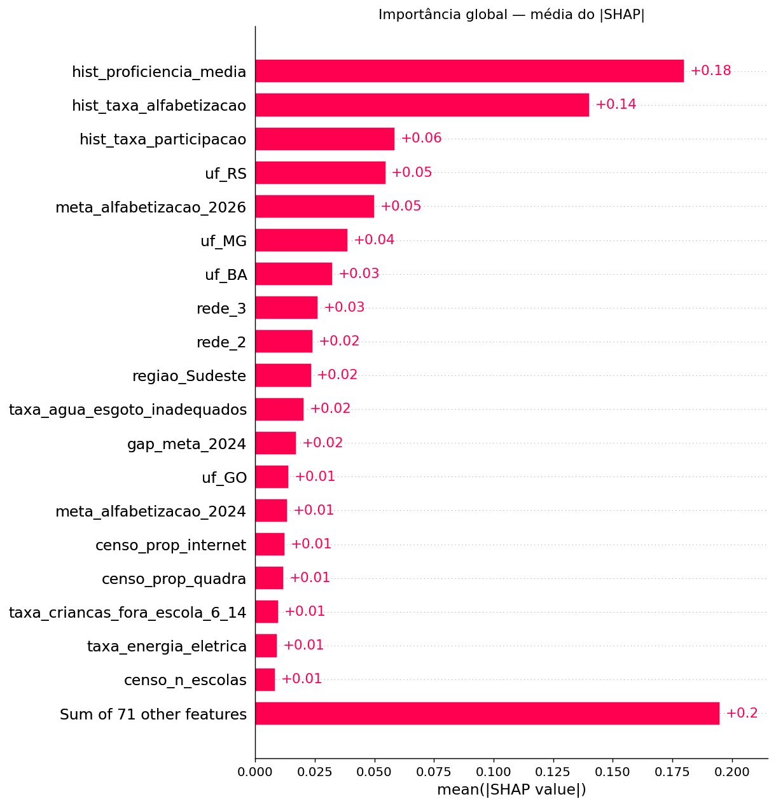
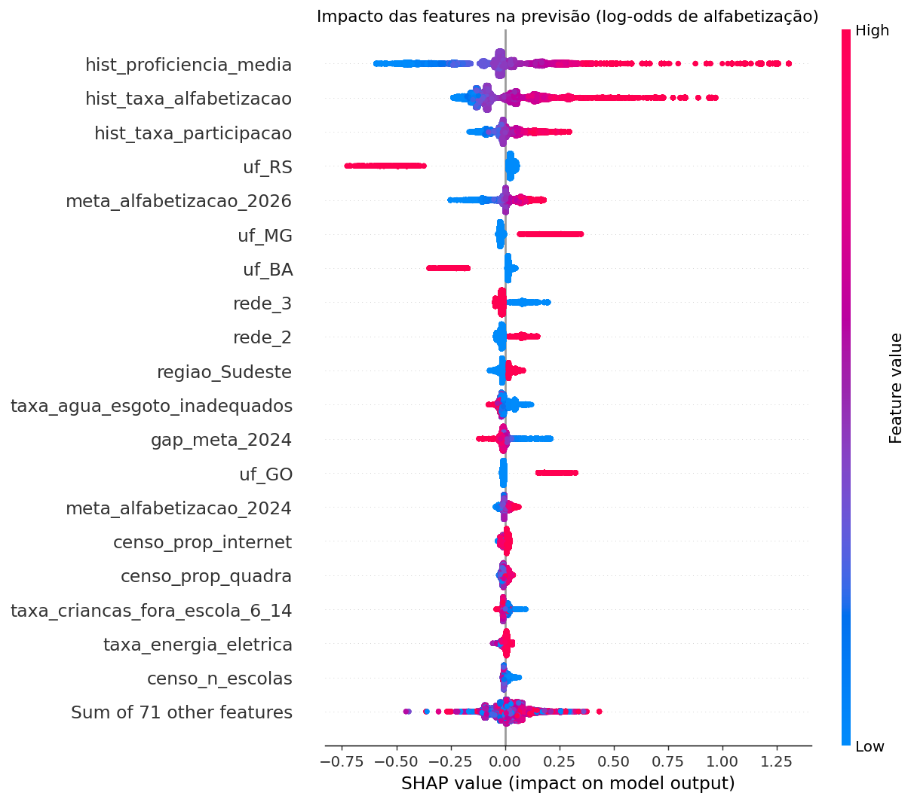
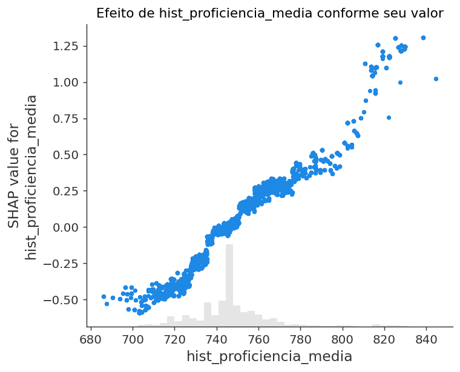
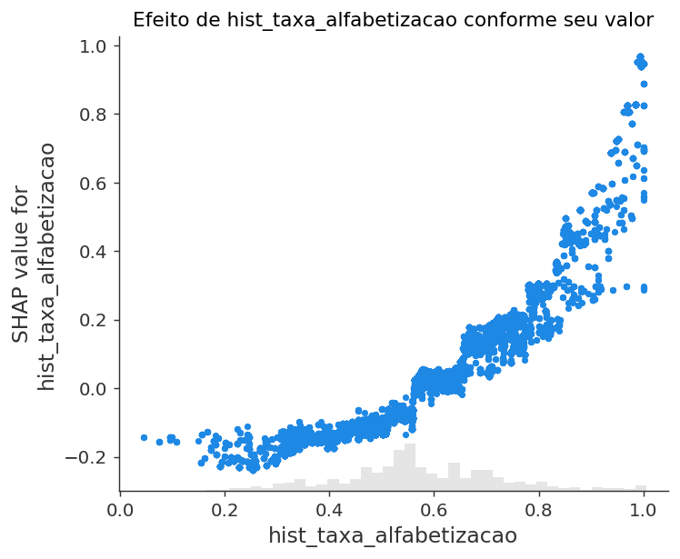
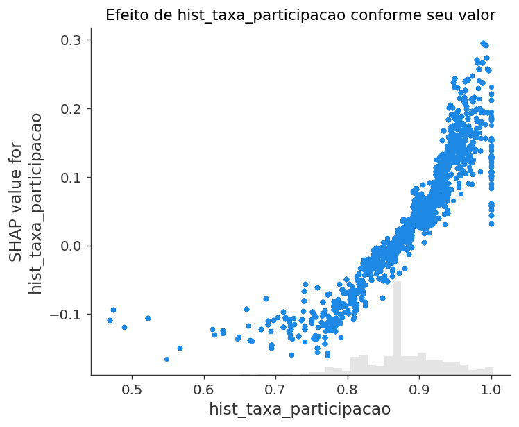
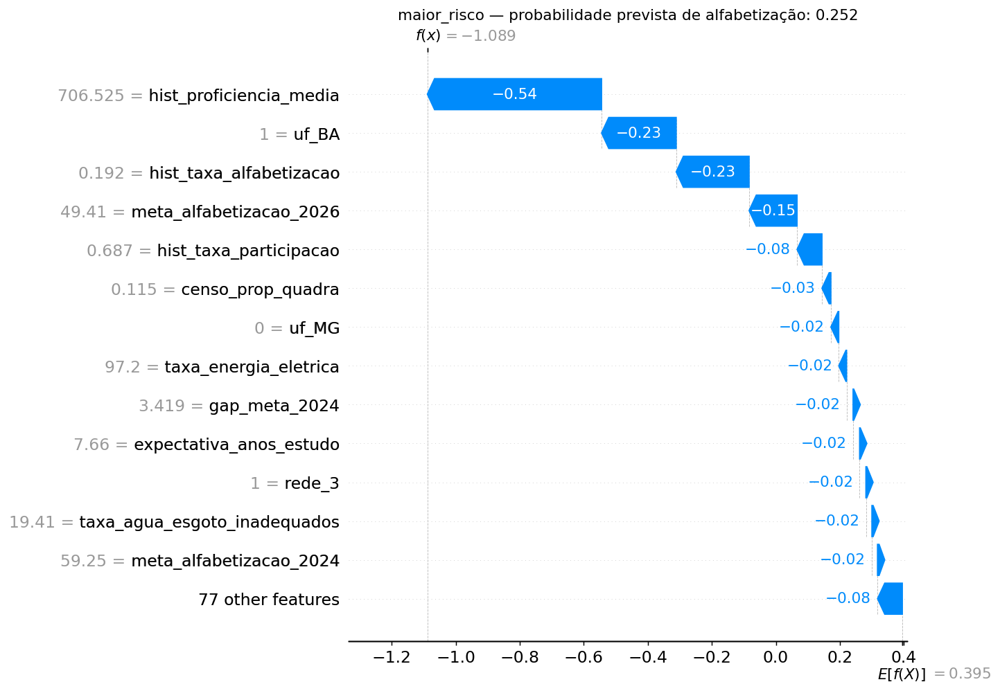
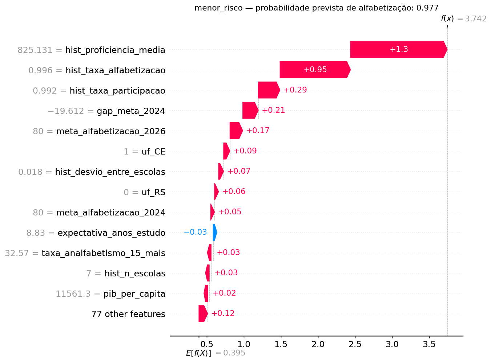
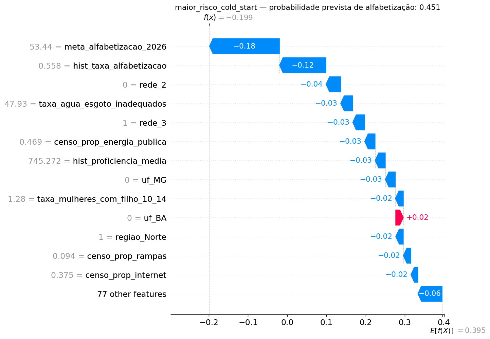

# Fase 5 — Interpretabilidade

```
python -m src.evaluation.interpretabilidade
```

**30.000 alunos do conjunto de teste · 90 features após encoding · TreeExplainer (exato)**

O enunciado recomenda Feature Importance **e** SHAP Values. Usamos os dois — e a
divergência entre eles é, ela própria, um achado.

---

## A armadilha que quase invalidou tudo: espaço de log-odds

O `TreeExplainer` sobre XGBoost explica a **margem** do modelo, não a probabilidade. Somar
`base_value + valores SHAP` devolve log-odds. Comparar isso diretamente com `predict_proba`
faz a verificação da propriedade da eficiência falhar por uma margem enorme — e o erro
**parece bug da biblioteca** quando é confusão de espaço.

| Verificação | Erro máximo |
|---|---|
| `sigmoide(base + Σ SHAP)` vs `predict_proba` | **2,98 × 10⁻⁷** |
| `base + Σ SHAP` vs `predict_proba` (errado) | **2,765** |

Sete ordens de grandeza de diferença. A conta certa fecha; a ingênua erra por unidades
inteiras de probabilidade.

Isso está travado em teste (`tests/test_modelo_final.py`), e o teste verifica **as duas
coisas**: que a conta certa fecha e que a errada não fecha. Se um dia ambas fecharem, o
`TreeExplainer` mudou de espaço e todos os gráficos deste relatório precisam ser relidos.

**Validação cruzada do valor base:** o `base_value` de 0,3952 em log-odds equivale a 0,5975
em probabilidade — praticamente idêntico à taxa de alfabetização da base (60,0%). É a
confirmação de que o explicador foi construído sobre o modelo certo.

---

## Importância global

| # | Feature | \|SHAP\| médio | Direção |
|---|---|---|---|
| 1 | `hist_proficiencia_media` | 0,1800 | +0,981 |
| 2 | `hist_taxa_alfabetizacao` | 0,1402 | +0,904 |
| 3 | `hist_taxa_participacao` | 0,0586 | +0,902 |
| 4 | `uf_RS` | 0,0548 | **−0,989** |
| 5 | `meta_alfabetizacao_2026` | 0,0502 | +0,963 |
| 6 | `uf_MG` | 0,0389 | +0,965 |
| 7 | `uf_BA` | 0,0325 | −0,981 |
| 8 | `rede_3` (municipal) | 0,0265 | −0,904 |
| 9 | `rede_2` (estadual) | 0,0243 | +0,926 |
| 10 | `regiao_Sudeste` | 0,0236 | +0,883 |
| 11 | `taxa_agua_esgoto_inadequados` | 0,0206 | −0,560 |

**Sobre a medida de direção.** Ela é a correlação entre o valor da feature e seu valor SHAP,
não a média do SHAP com sinal. A primeira versão usava a média com sinal e ela deu o sinal
**invertido** para `meta_alfabetizacao_2026`, em contradição direta com o que o beeswarm
mostrava: um aglomerado denso de efeitos levemente negativos supera numericamente uma cauda
esparsa de efeitos fortemente positivos. O erro foi pego ao conferir o gráfico contra a
tabela — e é a razão de as duas coisas precisarem ser olhadas juntas.




---

## O achado principal: o modelo trocou um proxy pela variável real

A Fase 5 rodou duas vezes — antes e depois da correção do bug de ingestão que ela mesma
revelou. A comparação dos dois rankings é o resultado mais interessante desta fase:

| Feature | Antes da correção | Depois |
|---|---|---|
| `hist_proficiencia_media` | **1º** (0,194) | **1º** (0,180) |
| `meta_alfabetizacao_2026` | **2º** (0,141) | 5º (0,050) |
| `hist_taxa_alfabetizacao` | 8º (0,028) | **2º** (0,140) |

Antes, 21,2% da base não tinha a taxa histórica (São Paulo, por falha de ingestão). O modelo
compensava apoiando-se na **meta pactuada**, que correlaciona **0,947** com a taxa histórica
— ou seja, usava a meta como *proxy* do nível educacional do município. Com o dado real
disponível, a taxa subiu para 2º e a meta caiu para 5º.

**A AUC quase não se moveu (0,6590 → 0,6591 em CV), mas a lógica interna do modelo mudou.**
Nenhuma métrica de performance teria detectado isso. Só a interpretabilidade detectou.

Esse é o argumento prático a favor de SHAP que vale levar para a apresentação: ele não serve
só para explicar o modelo ao usuário final — serve para o cientista de dados **auditar o
próprio pipeline**.

---

## Cuidado ao ler: correlação divide o crédito

As três variáveis de topo são fortemente correlacionadas entre si. `meta_alfabetizacao_2026`
correlaciona 0,947 com `hist_taxa_alfabetizacao`; ambas correlacionam alto com
`hist_proficiencia_media`.

O SHAP **reparte o crédito** entre features correlacionadas. Lê-las como contribuições
independentes seria erro. A leitura correta é que elas formam **um único sinal** — "o nível
educacional prévio do município" — que domina o modelo com folga sobre tudo mais.

E vale o lembrete padrão, que aqui não é formalidade: **o modelo mede associação, não causa.**
Infraestrutura escolar aparecer associada a melhor alfabetização não autoriza concluir que
construir bibliotecas alfabetiza — municípios com biblioteca têm também mais orçamento, mais
formação docente e menos pobreza.

---

## A anomalia do Rio Grande do Sul

`uf_RS` é a 4ª feature mais importante, com direção **−0,989**: ser do RS empurra fortemente
para *não alfabetizado*. Isso é contraintuitivo e vale investigar em vez de aceitar.

| UF | Proficiência média 2023 | Taxa de alfabetização 2024 | Posição |
|---|---|---|---|
| RS | 748,6 | **0,458** | 4º pior |
| MG | 753,0 | 0,726 | 24º de 27 |

Proficiência praticamente igual, desfecho radicalmente diferente. O RS teve uma **queda
atípica** entre 2023 e 2024 que o histórico municipal, sozinho, projetaria errado — o modelo
usa `uf_RS` como **termo de correção** para não superestimar o estado.

Isso é honesto sobre o que o modelo faz e também expõe uma fragilidade: com apenas um par de
anos (2023→2024), o modelo não distingue uma queda estrutural de uma flutuação pontual. Se a
queda do RS foi conjuntural, essa correção envelhece mal.

---

## Feature Importance nativa × SHAP: onde discordam

| Feature | Posição por `gain` | Posição por SHAP | Diferença |
|---|---|---|---|
| `uf_RJ` | 18 | 86 | 68 |
| `uf_RO` | 21 | 81 | 60 |
| **`censo_prop_rural`** | **83** | **28** | **55** |
| `uf_SP` | 23 | 74 | 51 |
| `uf_AM` | 24 | 75 | 51 |
| `regiao_Nordeste` | 22 | 70 | 48 |
| **`taxa_energia_eletrica`** | **66** | **18** | **48** |

O padrão é nítido e vai nos dois sentidos:

- **Dummies de UF são superestimadas pelo `gain`.** O `gain` mede o ganho acumulado nas
  divisões em que a feature é usada. Uma dummy de UF particiona a base de forma limpa e é
  escolhida muitas vezes, acumulando ganho — mesmo quando cada divisão move pouco a previsão
  final.
- **Variáveis contínuas de contexto são subestimadas pelo `gain`.** `censo_prop_rural` está
  em 83º por `gain` e 28º por SHAP; `taxa_energia_eletrica`, 66º contra 18º. Elas são usadas
  em poucas divisões, mas cada uma desloca a previsão de forma consistente.

**Conclusão prática:** usar `feature_importances_` para responder "quais variáveis mais
impactam a alfabetização" daria a resposta errada — apontaria o estado onde a criança mora
como fator dominante e esconderia saneamento e eletrificação. O enunciado pede as duas
técnicas; este é o motivo de a resposta de negócio vir do SHAP.

---

## Dependência: onde o efeito muda





`hist_proficiencia_media` tem a cauda mais longa de todas: municípios com proficiência muito
alta em 2023 recebem empurrão de até +1,7 em log-odds. Isso explica por que ela supera a
taxa de alfabetização mesmo as duas medindo a mesma coisa — a taxa **binariza** no corte 743
e joga fora a distância até ele, enquanto a proficiência preserva *quão longe* o município
está do limiar.

Foi exatamente o racional documentado em `reports/03_features.md` quando a feature foi
criada. O SHAP confirmou a hipótese.

---

## Explicações individuais

| Caso | UF | Rede | Probabilidade prevista |
|---|---|---|---|
| Maior risco | BA | municipal | 0,252 |
| Menor risco | CE | municipal | 0,977 |
| Maior risco em cold start | AC | municipal | 0,451 |





O contraste BA × CE é instrutivo: mesma rede, mesma ausência de informação individual, e
previsões em extremos opostos — a diferença vem inteiramente do município. É a demonstração
visual do limite estrutural do modelo: **ele não sabe nada sobre a criança**.

O caso de cold start mostra o oposto: sem histórico, a explicação se apoia em UF e contexto
socioeconômico, e a previsão fica perto de 0,45 — sem convicção em nenhuma direção. É o
retrato de uma previsão que o gestor não deveria tratar como informativa.

---

## Artefatos

| Arquivo | Conteúdo |
|---|---|
| `reports/shap_importancia.csv` | \|SHAP\| médio e direção, todas as 90 features |
| `reports/shap_vs_gain.csv` | Confronto entre as duas medidas de importância |
| `reports/interpretabilidade.json` | Verificação da eficiência, valor base, casos individuais |
| `images/shap_*.png` | 8 figuras |
