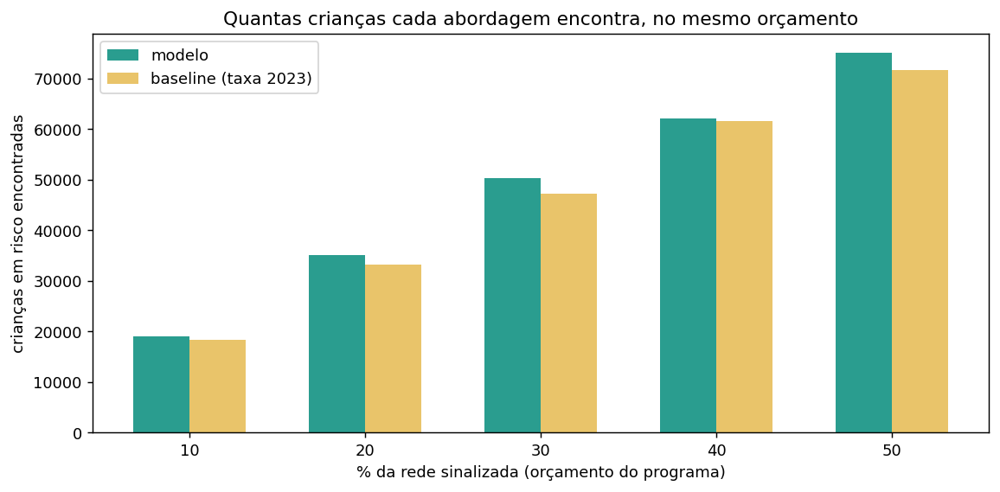
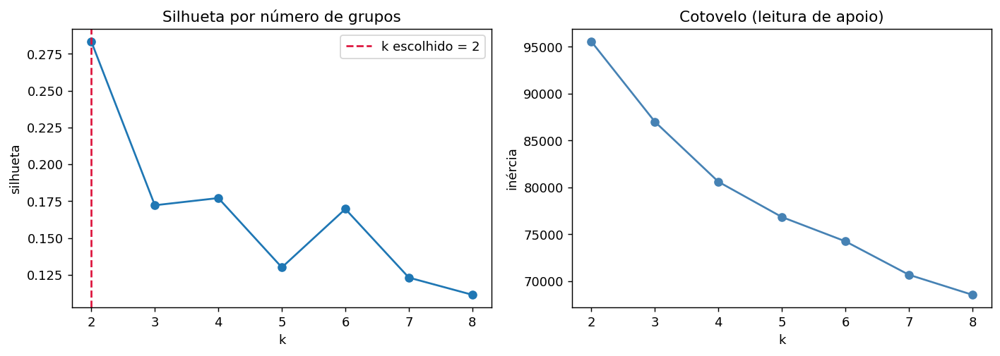
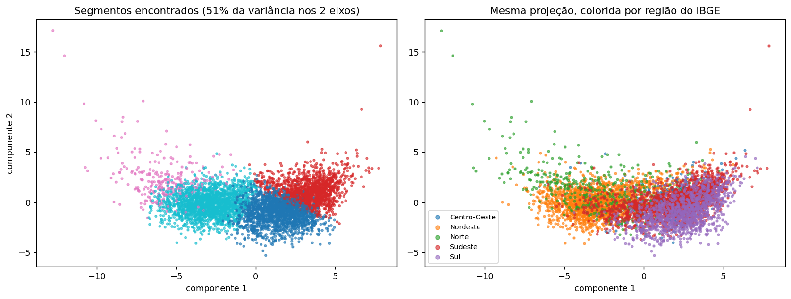

# Fase 6 — Aplicação estratégica

```
python -m src.evaluation.comparacao_justa   # modelo x baseline a sinalização igual
python -m src.application.risco_municipal   # ranking + projeção contra metas
python -m src.application.clusterizacao     # segmentação de municípios
```

As cinco perguntas de negócio do enunciado:

| Pergunta | Seção |
|---|---|
| Quais fatores mais impactam a alfabetização? | `reports/05_interpretabilidade.md` |
| Quais variáveis têm maior influência no modelo? | `reports/05_interpretabilidade.md` |
| Quais municípios apresentam maior risco educacional? | §2 |
| Como prever municípios que podem não atingir metas? | §3 |
| Quais regiões possuem padrões semelhantes? | §4 |

---

## 1. O modelo é fraco no aluno e forte no município

Este é o resultado que organiza toda a aplicação prática.

| Nível de agregação | Medida | Modelo | Baseline (taxa 2023) |
|---|---|---|---|
| **Aluno** | AUC-ROC | 0,6633 | 0,6371 |
| **Município** | Spearman previsto × observado | **0,7775** | **0,6238** |

No nível do aluno, o ganho sobre a régua atual é modesto. No nível do município, o modelo
ordena substancialmente melhor que simplesmente repetir o resultado do ano anterior:
**+0,153 de correlação de ordem**.

Não há contradição. Os microdados são anonimizados sob LGPD e **não contêm nenhum atributo
do aluno** — nem sexo, nem idade, nem condição socioeconômica. Todas as features são
municipais, então dois alunos do mesmo município e da mesma rede são idênticos para o
modelo. O teto da predição individual é estrutural: o modelo não recebe nada que distinga
crianças dentro de um município.

O que ele faz bem é estimar o **nível municipal**, e é nesse nível que a política pública
opera — orçamento, apoio técnico e formação de professores são alocados por rede, não por
criança.

**Ler a AUC de 0,66 como "modelo fraco" seria avaliar a ferramenta pelo uso errado.**

### A comparação honesta no nível do aluno

Comparar modelo e baseline no threshold fixo de 0,5 é enganoso: os dois sinalizam frações
diferentes da rede, e quem sinaliza mais naturalmente alcança mais recall. A pergunta certa
para um gestor é outra — **dado que só consigo atender N% da rede, qual encontra mais
crianças em risco?**

| Orçamento | Modelo encontra | Baseline encontra | Ganho |
|---|---|---|---|
| 10% da rede | 18.995 | 18.412 | +583 (+3,2%) |
| 20% | 35.169 | 33.184 | +1.985 (+6,0%) |
| 30% | 50.262 | 47.225 | +3.037 (+6,4%) |
| 40% | 62.208 | 61.687 | +521 (+0,8%) |
| 50% | 75.076 | 71.720 | +3.356 (+4,7%) |

De 116.844 crianças não alfabetizadas no teste, o modelo encontra entre **0,8% e 6,4% mais**
que a régua atual, no mesmo orçamento.

> **Correção registrada.** Uma versão anterior deste projeto reportou "+24.984 crianças
> encontradas", número obtido comparando no threshold 0,5. Aquela comparação era injusta:
> favorecia o modelo por ele sinalizar uma fração diferente da rede. O ganho real, a
> orçamento igual, é o da tabela acima.

A não monotonicidade em 40% tem causa conhecida: o baseline atribui **o mesmo escore a todos
os alunos de um município**, então o corte por quantil inclui ou exclui municípios inteiros
de uma vez, produzindo saltos.



---

## 2. Quais municípios apresentam maior risco educacional

Ranking de todos os 5.517 municípios pela taxa de alfabetização esperada em 2024.

**Validação — feita exclusivamente nos 1.104 municípios de teste**, que não participaram do
treino em nenhuma etapa:

| | |
|---|---|
| Correlação de ordem (Spearman) | 0,7775 |
| Taxa real no decil de **maior** risco previsto | **36,3%** |
| Taxa real no decil de **menor** risco previsto | **84,5%** |
| Separação | **48,3 p.p.** |


O decil que o modelo aponta como mais crítico tem, de fato, menos da metade da taxa de
alfabetização do decil mais favorável. O ranking ordena.

O topo da lista é dominado por municípios da Bahia, com taxas previstas em torno de 0,25 —
consistente com a BA ser a UF de pior desempenho observado (36,0%).

**Como esta lista deve ser usada.** Ela prioriza, não condena. Um município no topo é um
município cujo contexto prévio indica dificuldade, o que justifica **olhar primeiro** — não
punir. A coluna `situacao_historico` informa a qualidade da evidência: `completo` (histórico
do microdado), `parcial` (só a taxa agregada) ou `ausente` (cold start, previsão pouco
confiável).

Artefato: `reports/ranking_risco_municipal.csv`, 5.517 linhas.

---

## 3. Municípios que podem não atingir as metas

Comparando a taxa prevista com a meta pactuada de cada município:

**2.136 de 5.517 municípios (38,7%) fora de rota para a meta de 2024 — 797.017 alunos.**

### O paradoxo do Sul

| Região | Risco educacional médio | % em risco de perder a meta |
|---|---|---|
| Norte | 0,491 | 49,2% |
| Nordeste | 0,433 | 42,3% |
| **Sul** | **0,357** | **66,0%** |
| Sudeste | 0,297 | 20,9% |
| Centro-Oeste | 0,285 | 10,5% |

O Sul tem o **terceiro melhor** desempenho educacional previsto e a **maior** fração de
municípios fora de rota. Não é contradição — é consequência de as metas do Sul terem sido
pactuadas em patamar mais ambicioso.

**São dois indicadores distintos, e confundi-los leva a decisão errada:**

- **risco educacional** — onde as crianças têm menos chance de se alfabetizar
- **risco de meta** — onde o compromisso pactuado está mais distante do resultado esperado

Um município pode ir bem e ainda assim perder a meta; outro pode ir mal e cumprir a sua.
Apoio técnico-pedagógico deve seguir o primeiro indicador; discussão de repactuação, o
segundo.

### Limite honesto desta seção

O modelo prevê **2024**. O confronto com a meta de 2026 mede a distância **atual** até aquela
meta, assumindo estagnação — é alerta de rota, não projeção temporal. Prever 2026 exigiria
uma série histórica maior que os dois anos disponíveis.

---

## 4. Quais regiões possuem padrões semelhantes

K-Means sobre 25 variáveis de perfil municipal (socioeconômicas, infraestrutura escolar e
desempenho histórico), **sem usar o resultado de 2024**. Escalonamento obrigatório aqui —
diferente das árvores, o K-Means mede distância euclidiana e uma variável em unidades de
população dominaria uma em proporção.

### A ausência de estrutura é o achado

| k | 2 | 3 | 4 | 5 | 6 | 7 | 8 |
|---|---|---|---|---|---|---|---|
| silhueta | **0,283** | 0,172 | 0,177 | 0,130 | 0,170 | 0,123 | 0,111 |

**Nenhuma silhueta passou de 0,30.** Os municípios brasileiros **não formam grupos
discretos** — formam um contínuo de desenvolvimento. O k=2 que a silhueta aponta apenas
recupera a divisão regional já conhecida (69,4% do grupo menos favorecido é Nordeste).



Por isso adotamos uma **segmentação operacional em k=4**, declarada pelo que é: ela não
descobre grupos naturais, ela **particiona o contínuo em faixas úteis** para direcionar
política. Apresentar o k=4 como "grupos descobertos nos dados" seria sobrevender o resultado.

### Os quatro segmentos

| Segmento | n | Perfil | Composição | Risco previsto | Taxa real |
|---|---|---|---|---|---|
| 0 | 1.767 | Agropecuário, pequeno porte, renda acima da média | 42% Sul, 35% Sudeste | 0,306 | 69,8% |
| 1 | 1.479 | Urbano industrial, maior renda e infraestrutura | 55% Sudeste | 0,353 | 64,9% |
| **2** | **295** | **Saneamento 3x pior, 2x crianças fora da escola** | **57% Norte, 38% Nordeste** | **0,464** | **53,7%** |
| 3 | 1.976 | Pobreza e analfabetismo adulto acima da média | 78% Nordeste | 0,421 | 57,7% |



**O segmento 2 é o achado acionável desta seção.** São apenas 295 municípios — 5,3% do país —
concentrando os piores indicadores:

| Indicador | Desvio da média nacional |
|---|---|
| Água e esgoto inadequados | **+296%** |
| Crianças de 6 a 14 fora da escola | **+202%** |
| Pobreza | +122% |
| População rural | +108% |

E é o segmento com **pior desfecho educacional real** (53,7%) e **maior fração fora de rota**
para a meta (50,5%).

Um alvo de 295 municípios é operacionalmente tratável de um jeito que "o Nordeste vai mal"
não é. E o perfil sugere que a intervenção eficaz pode não ser primariamente educacional —
saneamento e acesso à escola aparecem como as distâncias mais extremas.

O painel da direita da figura mostra a mesma projeção colorida por região do IBGE: os
segmentos **não coincidem** com o mapa. Municípios do interior do Norte e do interior do
Nordeste compartilham perfil entre si mais do que com as capitais dos próprios estados.

---

## 5. Recomendações

1. **Usar o modelo como priorizador municipal, não como classificador de crianças.** É no
   nível municipal que ele demonstra capacidade (Spearman 0,78 contra 0,62 da régua atual), e
   é nele que o orçamento é alocado. Rotular uma criança individualmente seria usar a
   ferramenta fora da validade demonstrada.

2. **Adotar threshold por subgrupo.** No grupo de histórico parcial, o corte de 0,5 produz
   recall de risco de **1%** — as probabilidades ficam comprimidas acima do corte por efeito
   da imputação. Como o threshold é parâmetro de gestão e não exige retreinar, é ajuste de
   configuração. Aplicar 0,5 uniformemente deixaria 51 mil crianças fora da triagem.

3. **Separar risco educacional de risco de meta.** Indicadores diferentes, respostas
   diferentes — apoio pedagógico num caso, repactuação no outro.

4. **Publicar um identificador de escola pseudonimizado porém estável.** Hoje o `id_escola` é
   re-sorteado a cada ano, impedindo qualquer análise longitudinal de escola. Medimos que
   **17,7% da variação do resultado está entre escolas do mesmo município** — sinal real,
   hoje inalcançável. Um ID estável, sem reidentificar ninguém, destravaria essa camada
   inteira de política pública.

5. **Completar a cobertura do microdado.** São Paulo não tem microdado de 2023 na base
   pública: 21,2% dos alunos ficam com histórico apenas parcial, sem proficiência — que é a
   feature mais importante do modelo. É a maior lacuna de dado do projeto e a de correção
   mais barata.

6. **Concentrar esforço nos 295 municípios do segmento 2**, com intervenção que trate
   saneamento e acesso à escola, não apenas pedagogia.

---

## Artefatos

| Arquivo | Conteúdo |
|---|---|
| `reports/ranking_risco_municipal.csv` | 5.517 municípios ordenados por risco |
| `reports/risco_municipal.json` | Validação do ranking e projeção contra metas |
| `reports/comparacao_justa.{csv,json}` | Modelo × baseline a orçamento igual |
| `reports/clusters_municipais.csv` | Grupo e segmento de cada município |
| `reports/segmentos_caracteristicas.csv` | O que distingue cada segmento |
| `reports/clusterizacao.json` | Diagnóstico de k e cruzamento com risco |
| `images/` | 16 figuras (4 da EDA + 12 das Fases 5-6) |
